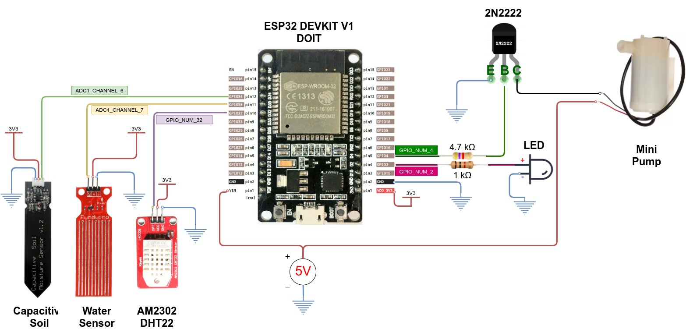

[](https://gitlab.com/ever3001/iotsmartplant)
[](https://opensource.org/licenses/MIT)

# IoTSmartPlant

Smart pot inspired on the [SmartPlantV1](https://github.com/DIY-Machines/SmartPlantV1) project. I Added Wi-Fi and MQTT feature to connect with a MQTT. I create this project to improve the idea but also because I wanted to learn about ESP32, Multitasking, MQTT, FreeRTOS and ESP-IDF.

I test this project with the boards ESP32 DEVKIT V1 and ESP32 TT1.
## Project status
[](https://www.repostatus.org/#active)

## Materials used
- [ESP32 DEVKIT V1](https://aliexpi.com/O208)
- [Mini submersible pump](https://aliexpi.com/nxGM)
- [5mm tubing](https://aliexpi.com/nxGM)
- [Transistor 2N2222](https://aliexpi.com/3Rwf)
- [Resistor 1 kΩ](https://aliexpi.com/fG14)
- [Resistor 4.7 kΩ](https://aliexpi.com/fG14)
- [3mm LED](https://aliexpi.com/fudh)
- [Capacitive moisture sensor](https://aliexpi.com/Ybzc)
- [Water level sensor](https://aliexpi.com/yfMp)
- [Humidity and Temperature sensor](https://aliexpi.com/JSlJ)

## Diagram



## Code building

This project uses Gitlab CI for testing and generating final binaries. For more information please visit the webpage [Job artifacts](https://docs.gitlab.com/ee/ci/pipelines/job_artifacts.html).

To build locally the project, please [install PlatformIO](https://platformio.org/install).

Before compile the project, please change the definitions in [platformio.ini](./platformio.ini):

```
  [env]
  ...
  -DCONFIG_WIFI_SSID='"YOUR SSID"'
  -DCONFIG_WIFI_PASS='"admin"'
  ...
```

### Build all environemnts

```Shell
platformio run
```

### Build just one environemnt

```Shell
platformio run --environment esp32-iotsmartplant-release
```

See the [platformio.ini](./platformio.ini) for details about the different environments.

## TODO

- [ ] Fix Warnings in code.
- [ ] Add 3D Files for printing the pot.
- [ ] Create PCB files.
- [ ] Create documentation pages with Sphinx.
- [ ] Create Unit tests.

## Contributing

If you would like to contribute, please see the [instructions](./CONTRIBUTING.md).

This project is inspired and partially based on the [SmartPlantV1](https://github.com/DIY-Machines/SmartPlantV1) project, thanks [DIY Machines](https://www.youtube.com/channel/UC3jc4X-kEq-dEDYhQ8QoYnQ) for your work.

## License

This project is licensed under the MIT License - see the [LICENSE](./LICENSE) file for details.
